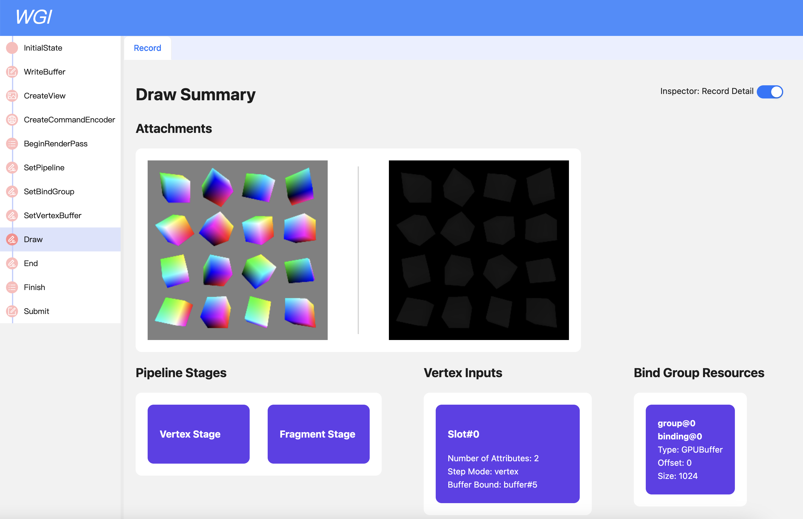
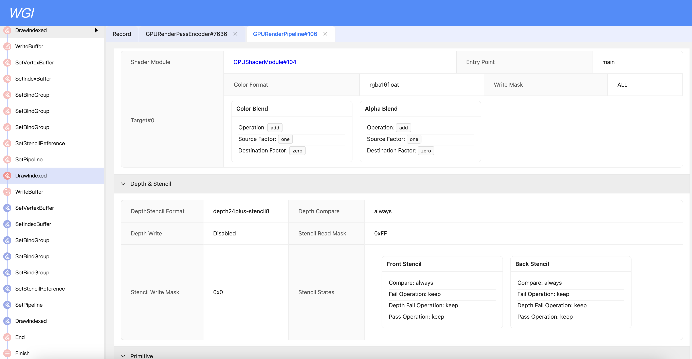

# WGI
WGI stands for "WebGPU Inspector/Insight/whatever", which aims to provide a powerful debugging tool for WebGPU development.  
WGI uses a mechanism of recording/replaying to reconstruct every resource at any time point during capturing. Then trys to display them in a developer-friendly fashion.

### Currently under development.

Here's some preview:  

## Build
Since the project is not quite finished yet, I'm not expecting a lot people trying to build it. I'll describe it here in brief.  
1. npm install
2. npm run build-plugin
3. use chrome to load plugin folder as unzippped extension
4. goto "https://webgpu.github.io/webgpu-samples/samples/", and try to capture a frame by clicking the "Capture!" button in the popup window of the extension. If nothing is downloaded, try refreshing the page.
5. npm run build-viewer && npm run test-viewer
6. open "localhost:8188", then drag&drop your capture file into the viewer.

## Pending Work
- [ ] Complete the driver layer, which is currently lacking implementation of some major functions(ComputePass, ExternalTexture, RenderBundle, etc...);
- [ ] Make a more useful plugin;
- [ ] Heavy work on the viewer, including making it prettier, adding more information to the draw summay page, so on.

## APIs not supported yet
If your page uses any one of below, WGI driver will throw an error and your page will not render correctly.
#### Common
+ destroy() of any GPU resrouce;
#### GPUDevice
+ importExternalTexture
+ createComputePipeline
+ createComputePipelineAsync
+ createRenderPipelineAsync
+ createRenderBundleEncoder
+ createQuerySet
+ pushErrorScope
+ popErrorScope
+ onuncapturederror
+ addEventListener
+ dispatchEvent
+ removeEventListener
#### GPUCommandEncoder
+ beginComputePass
+ copyBufferToTexture
+ copyTextureToBuffer
+ clearBuffer
+ resolveQuerySet
+ pushDebugGroup
+ popDebugGroup
+ insertDebugMarker
#### GPURenderPassEncoder
+ setBlendConstant
+ beginOcclusionQuery
+ endOcclusionQuery
+ executeBundles
+ pushDebugGroup
+ popDebugGroup
+ insertDebugMarker
+ drawIndirect
+ drawIndexedIndirect

